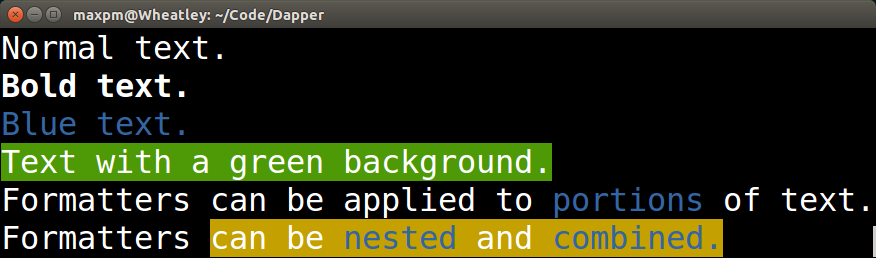

Introduction
============
Dapper provides D support for the text formatting subset of
[ANSI escape codes](https://en.wikipedia.org/wiki/ANSI_escape_code).  ANSI
escape codes are a set of special output sequences that let you do things like
output colored text or clear part of the terminal window.

Dapper is licensed under the permissive
[MIT license](http://choosealicense.com/licenses/mit/).  See the top of
[Dapper.d](/Dapper.d) for details.

Usage Example
=============



```d
import std.stdio;
import Dapper;

void main()
{
	writeln("Normal text.");
	
	writeln(bold("Bold text."));
	
	writeln(blue("Blue text."));
	
	writeln(greenBG("Text with a green background."));
	
	writeln("Formatters can be applied to ", blue("portions"), " of text.");
	
	writeln("Formatters ", yellowBG("can be ", blue("nested"), " and ", blue("combined.")));
}
```

Features
========
- Formatters for bold, underlined and blinking text
- Text color and background color formatters for the 8 system-defined colors
- Define your own text and background colors with RGB coordinates or with a
  number from the XTerm 256-color palette
- Mix, match, stack and nest formatters to combine them any way you like
- Output function agnostic - use `writeln` from the standard library, or
  something else if you prefer
- Small and simple API

API Reference
=============

Formatter Listing: Colors
-------------------------

| For text       | For background   |
| -------------- | ---------------- |
| `defaultColor` | `defaultColorBG` |
| `black`        | `blackBG`        |
| `red`          | `redBG`          |
| `green`        | `greenBG`        |
| `yellow`       | `yellowBG`       |
| `blue`         | `blueBG`         |
| `magenta`      | `magentaBG`      |
| `cyan`         | `cyanBG`         |
| `white`        | `whiteBG`        |

The exact colors visible on the screen can be anything, depending on the host
terminal and how it's configured.  If you need more consistency, you might
want to look into creating your own color formatter (see below).

Formatter Listing: Other Formatters
-----------------------------------

| Other formatters |
| ---------------- |
| `noFormatting`   |
| `blink`          |
| `noBlink`        |
| `bold`           |
| `noBold`         |
| `underline`      |
| `noUnderline`    |

Making Your Own Color Formatters
--------------------------------

If none of the 8 predefined colors work for you, you can also make your own like
this:

    // With red, green, blue components from 0.0 to 1.0
    auto pink1 = Formatter.forColor(1.0, 0.08, 0.58);
    
    // With an index into the XTerm 256-color palette
    auto pink2 = Formatter.forColor(199);
    
    // It works the same way for background colors.
    auto pink1BG = Formatter.forBGColor(1.0, 0.08, 0.58);
    auto pink2BG = Formatter.forBGColor(199);

Then, use them like you would any other formatter.

    writeln("My favorite color is ", pink1("pink."));

Merging Formatters
------------------

Sometimes, you might find yourself using the same combination of formatters
over and over again, like this:

    writeln("Highlight ",          bold(white(yellowBG("this,"))));
    writeln("and also highlight ", bold(white(yellowBG("that."))));

In such cases, it might be convenient to *merge* those formatters into one.  The
`merge()` function returns a new formatter created from the combined effects of
whatever formatters you pass it.  Use it like this:

    auto highlight = merge(bold, white, yellow);
    
    writeln("Highlight ",          highlight("this,"));
    writeln("and also highlight ", highlight("that."));

Merging formatters like this can improve readability and maintainability.
